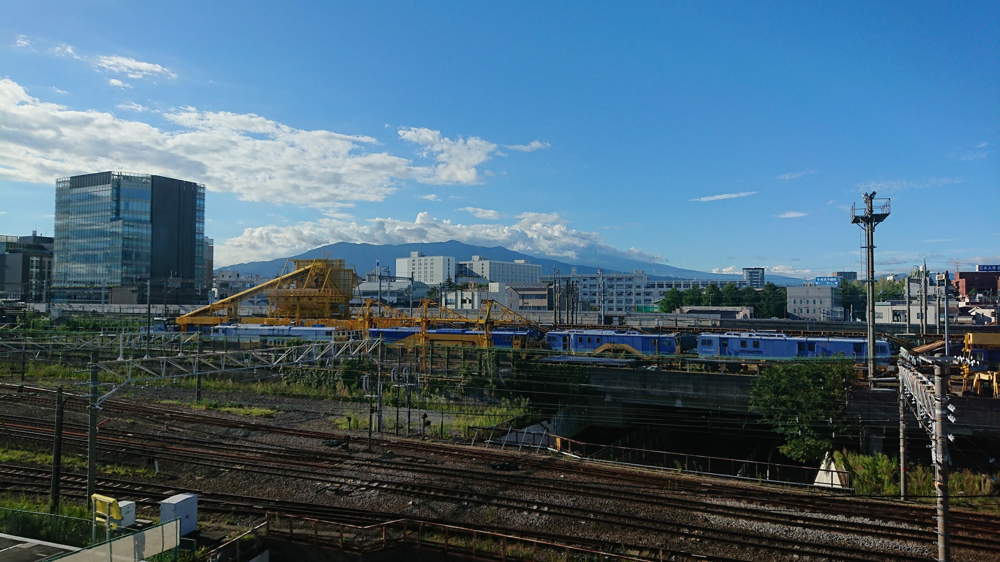
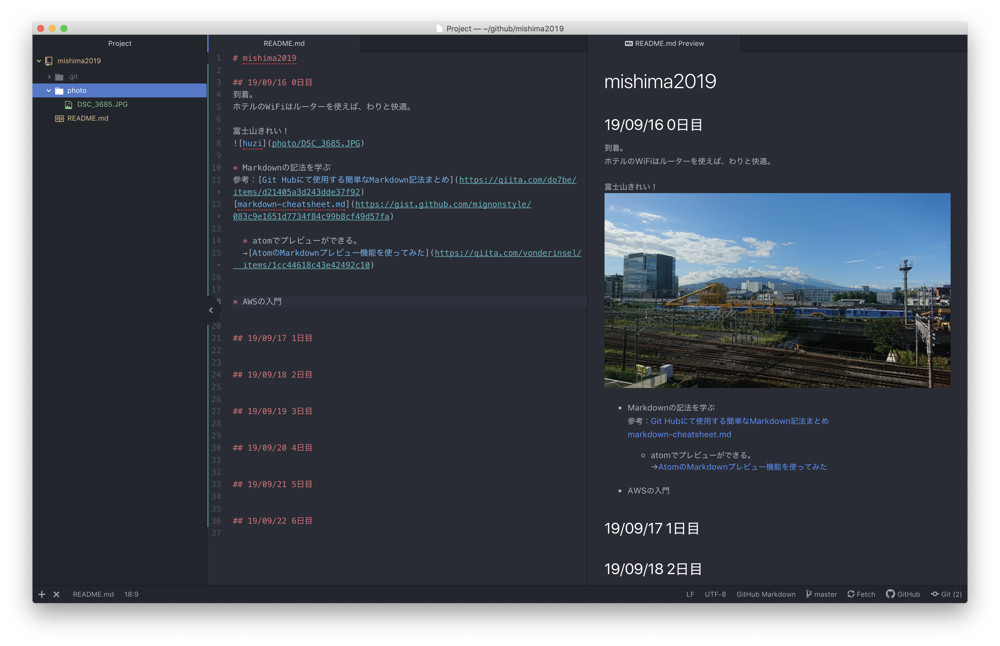
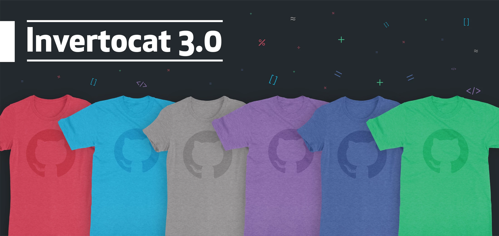
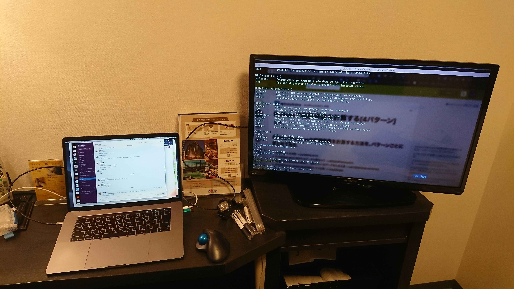
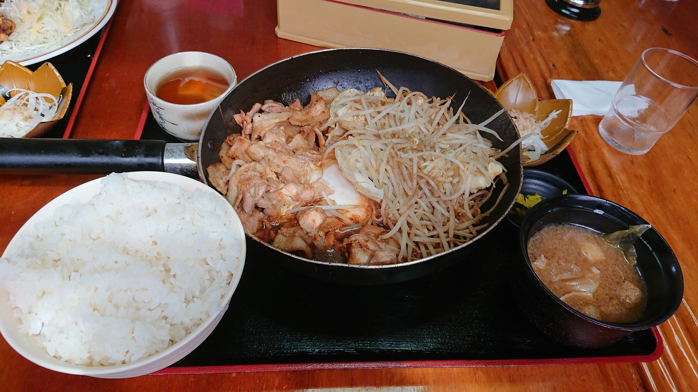
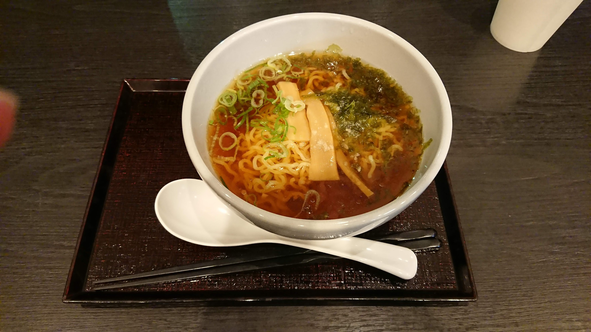

# mishima2019

## 進んだこと

### 0日目
 * 三島に到着
 * AWSに初めて触れる
 * atomでREADMEを書き始める（プレビュー機能）

### 1日目
 * metagenome解析（実行）
 * Nimに触れる、atomで動かす

### 2日目
 * BS-seq解析（実行、解読）終了！
 * 発現類似度の計算スクリプト、Pythonverを理解、Pandasで。
 * ikraで40サンプルほどをまわした。iDEPに入れることはできた。
 * IsoformSwitchAnalyzeRのダイジェスト版を実行する
 * metagenome、他のサンプルでもQIIME2で解析できないか試してみる（途中）

### 3日目

### 4日目

### 5日目

## 19/09/16 0日目
到着。  
ホテルのWiFiはルーターを使えば、わりと快適。  

富士山きれい！

* Markdownの記法を学ぶ  
参考：[Git Hubにて使用する簡単なMarkdown記法まとめ](https://qiita.com/do7be/items/d21405a3d243dde37f92)  
[markdown-cheatsheet.md](https://gist.github.com/mignonstyle/083c9e1651d7734f84c99b8cf49d57fa)

  * atomでプレビューができる。  
  →[AtomのMarkdownプレビュー機能を使ってみた](https://qiita.com/vonderinsel/items/1cc44618c43e42492c10)  
  

* AWSの入門

## 19/09/17 1日目

* 8:40発のバスで到着。

* 坊農さんより、いろんな話をお聞きする。  
 * 本の部数について初めて聞いたので驚いた

* githubの勉強
 * copyleft･･･公開されたソフトウェアなどについて、利用・再配布・改変の自由を認める思想。
 * キャラの商品がある  
 

 * topでhello worldと検索すると、全世界でのたくさんのタイプミスが見つかる。  
 https://github.com/search?q=hello+world  
 気にせず未熟なコードを書き込め！という意味だそう。

## 19/09/18 2日目

* [Human Re-sequencing](https://github.com/ddbj/human-reseq)
 * ヒトのデータはそのデータベースから持ち出せない→cwlを渡して、そのパイプラインで解析してもらって、結果だけもらう。統一させる。

* BS-seqも大きく変わる？
 * 今の技術は周りくどい。直接メチル化シトシンが読めればいい！  
 nanoporeの仕組み（電位差を読む）で、「メチル化シトシン」が読み取れればいけるのでは？あとは精度の問題か。

* RNA-seqも進歩の余地あり。
 * 今はcDNAに逆転写してるが、RNAの中にcDNAになりにくいものも。RNAを直接読みたい。nanopore？

* Python2のmac2はどうなる。。。

* ツールの開発は資金面が難しい。。。
  * イギリスのwellcome trust

* ほおずきおいしい。

* どこまでやりたいか。

* 2日目にして、ホテルのTVをモニタ化できることに成功！笑  
フロントにダメ元で聞いてみたところ、入力切り替えできるリモコンを貸してもらえました。  
ただHDMIケーブルは持参必須ですね。

## 19/09/19 3日目

* 今日は初富士山！

* メタゲノムも結局メタデータが一番大事。どんな条件でサンプルとったのか。突き詰めたら、その日の気温は、湿度は、等々。細胞の良さ具合とか。

* 寄生蜂。1個の卵が数個～数千個の胚を生じる。ゲノムはn半数体。
 * ソルジャー
* 真社会性→[真社会性・・・ハチやアリの社会はすごい](http://www.eonet.ne.jp/~kotetu/Eusociality.htm)

* シルク×パーキンソン病の論文→[Identification of key uric acid synthesis pathway in a unique mutant silkworm Bombyx mori model of Parkinson's disease.](https://www.ncbi.nlm.nih.gov/pubmed/23894418)

* micropython→[MicroPython ガイド](https://microbit.org/ja/guide/python/)

## 19/09/20 4日目

## 19/09/21 5日目

## 19/09/22 6日目

## お食事日記

### 0日目
* 夜  
 近くのラーメン屋にて。

### 1日目
* 昼

* 夜
ホテルの夜鳴きそば。

### 2日目

### 3日目

### 4日目

### 5日目

### 6日目
